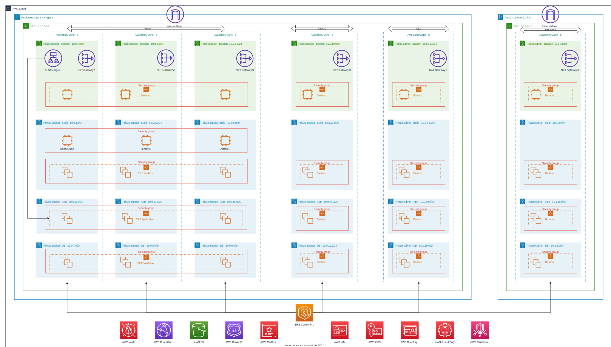

[[_TOC_]]

### Problem Statement
a customer working in the E-commerce platform who wants to host his Web-based application which connects with MongoDB ~~and ElasticSearch (You can implement any one of these)~~. He wants his Environment to be completely scalable and Highly Available and database to be clustered. He also wants you to give him a DR strategy.

He is open to the use of different flavors of Linux with appropriate reasoning.

He wants to stay cloud-agnostic and hence all the installations should be one click using a Configuration Management Tool (preference to Ansible).

Points for help: You have to use ~~AWS Cloudformation~~ Terraform for cloud services provisioning

 Create the whole Infrastructure including EKS, VPC, subnets, load balancers, etc.

 Keep in mind that **security** is very important.

 Create a CI server Jenkins(using Ansible). Create the CICD pipeline (Jenkins Groovy script) deploy code to Kubernetes using Helm charts.

 One-click deployment to any region would be great.

 The architecture design should be the core backbone or microservice.
Container orchestration tools:  AWS EKS.

### Architecture Diagram


### Architecture Description
The architecture is spread across 3 availability zones over 4 subnet groups.
* A public facing subnet group to hold bastion hosts, load balancers and NAT Gateways.
* A private subnet group with a matched worker-group to run non-application loads such as k8s support pods, jenkins workloads, etc.
* An extended private subnet group with a matched worker-group to run core application loads.
* A private subnet group with a matched worker-group dedicated to data-persistence loads.
* DNS with Route53 service
* AWS ACM for certificate management
* AWS WAF to work with AWS ALB as an additional firewall
* S3 with Cloudfront to serve static content globally
* AWS KMS for encryption key management
* AWS IAM with AD federation for identity management

#### OS recommendations
RHEL is a suitable choice for reliable and stable OS for VMs.  
A minimal and hardened version of RHEL should used as container base image for secure containers wrt to uniformity in system administation.  
Alpine Linux can also be considered for containers to create lightweight containers assisting with agility.

#### MongoDB
since the requirement is to have a clustered database, and the to have a cloud-agnostic but freely scalable setup, a MongoDB replicaset with arbiter node is deployed within kubernetes with helm charts. To keep the database secure and to control access, a separate set of subnets, namespace and worker groups are created with specific taints to prevent pods from being scheduled on the same nodes as mongodb pods.  
API access to mongo db can be controlled via k8s rbac service accounts supported with network policies within cluster and platform firewalls(security groups) on the infra level.

#### Scalablilty and High Availability
A dedicated /20 cidr block of ~4090x3 ips is assigned to app subnets/worker-group to accomodate free scaling of application pods with help of horizontal-pod-autoscaler and cluster-autoscaler.  
Traffic will be routed through ALB backed ingress-controller for performance under load.

#### Environments and DR
Depending upon the the region the eks cluster may be extended and partitioned over available AZs to act as different environments with dedicated networking resources(alb/ingress) to have centralised administration while not adversely affecting production loads.  
Since this is for an e-commerce platform, RTO and RPO must be both kept low. This can be achieved by extending the cluster over to a different region of the same CSP or a different CSP. A worker group can be provisioned in the DR zone that holds and fraction of pods and serves a fraction of production load during BAU, but is can be scaled out immediately in cases of outages. Network routing can be handled by the DNS and routers within the infrastructure with VPC peering.  
This will ensure confidence in the DR setup as well as keep the backups hot.

#### Security
* all data persistence devices/services will be encrypted with AWS KMS managed keys
* VM access must be secured with GSSAPI and IAM-AD federation
* Multiple layers of firewall ACLs with WAF over ALB, subnet acl, security groups, k8s rbac and network policies
* separation of concerns within the cluster with namespaces and node taint-tolerations for pod scheduling

#### IaC implemention
* VPC with 4 subnet groups across 3 AZs with route tables and nat gateways
* basion host auto-scaling-group in public subnet
* EKS Cluster with tainted worker groups in dedicated subnet tiers
* single node jenkins server setup with ansible config mgmt.
* jenkins within k8s cluster for scalable and containerised pipeline builds
* cluster level k8s resources and helm releases
* ALB backed nginx-ingress : WIP
* internal security groups : WIP
* k8s rbac matrix and svc acc : WIP

#### Sample Jenkinsfiles
https://gitlab.com/akuma5157/samplespringapp/-/blob/master/Jenkinsfile-shell
https://gitlab.com/akuma5157/samplespringapp/-/blob/master/Jenkinsfile

#### Setup Steps
```shell script
echo installing terraform
curl https://releases.hashicorp.com/terraform/0.13.0/terraform_0.13.0_linux_amd64.zip
unzip terraform_0.13.0_linux_amd64.zip
chmod +x ./terraform
sudo mv terraform /usr/local/bin/

echo installing kubectl
curl -LO https://storage.googleapis.com/kubernetes-release/release/$(curl -s https://storage.googleapis.com/kubernetes-release/release/stable.txt)/bin/linux/amd64/kubectl ; ",
chmod +x ./kubectl
sudo mv ./kubectl /usr/local/bin/

echo installing aws-iam-authenticator
curl -o aws-iam-authenticator https://amazon-eks.s3.us-west-2.amazonaws.com/1.17.7/2020-07-08/bin/linux/amd64/aws-iam-authenticator
chmod +x ./aws-iam-authenticator
sudo mv ./aws-iam-authenticator /usr/local/bin/

echo installing helm3
curl https://raw.githubusercontent.com/helm/helm/master/scripts/get-helm-3 | bash

echo installing helm repos
helm repo add stable       https://kubernetes-charts.storage.googleapis.com
helm repo add bitnami      https://charts.bitnami.com/bitnami
helm repo add incubator    http://storage.googleapis.com/kubernetes-charts-incubator
helm repo add nginx-stable https://helm.nginx.com/stable                            

echo installing ansible
curl https://bootstrap.pypa.io/get-pip.py -o get-pip.py
python3 get-pip.py --user
pip3 install --user ansible

echo installing ansible-roles
ansible-galaxy install geerlingguy.java
ansible-galaxy install geerlingguy.jenkins
ansible-galaxy install geerlingguy.docker
ansible-galaxy install geerlingguy.helm
ansible-galaxy install gantsign.maven


```
### Tech Stack
| Type | Tool |
| :--- | :--- |
| Cloud Provider | AWS |
| Provisioning | Terraform |
| Config. Mgmt. | Ansible |
| CI/CD | Jenkins |
| Container Orch. | EKS |
| App Deployments | Helm |